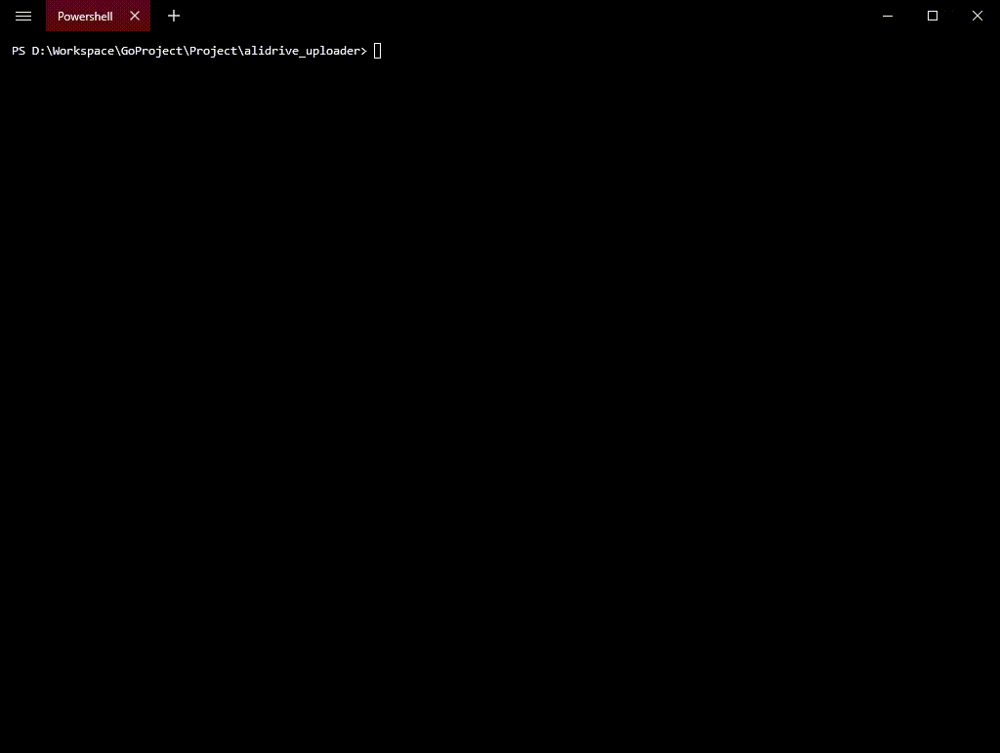
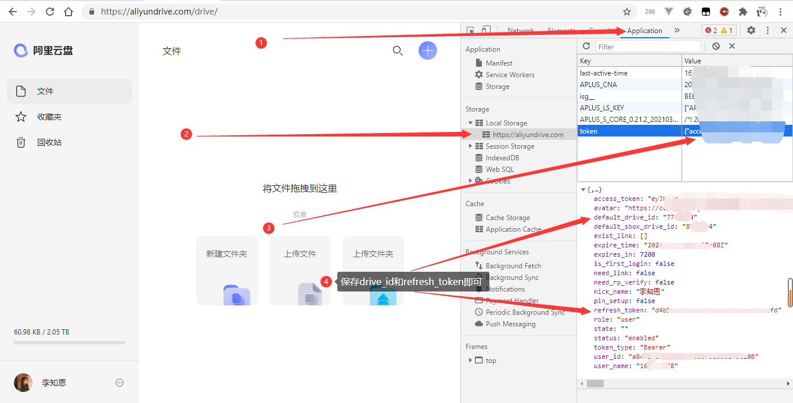

## 阿里云盘上传工具

> 如有侵权，请联系我删除
>
> 禁止用于非法用途，违者后果自负

> 觉得不错的可以给个star~

### 宝塔插件

<https://github.com/aoaostar/alidrive-uploader-for-baota>

## 演示



## 使用方法

```shell
curl -sL https://raw.githubusercontent.com/aoaostar/alidrive-uploader/v2/install.sh | bash 
```

* 重命名`example.config.yaml`为`config.yaml`
* 填写好`config.yaml`的内容



### 控制台快速获取代码

```javascript
var d = JSON.parse(localStorage.getItem('token'));
console.log(`\tdrive_id: ${d.default_drive_id}\n\trefresh_token: ${d.refresh_token}`);
```

### Proxy 使用方法

> 由于阿里云盘限制了海外，海外机器根本无法上传  
> 可以使用`--proxy`参数设置国内代理   
> 使用`nginx`配置反向代理，配置参数如下

```shell
location /{
  if ($request_uri ~ /){
    add_header content-type "application/json";
    return 200 "{\"usage\":\"Host/{URL}\"}";
  }
  if ($request_uri ~ ^/(.*)){
    set $proxy_url $1;
  }
  proxy_pass $proxy_url;
  resolver 8.8.8.8;
}
```

#### 使用示例

```shell
alidrive -p(--proxy) http://proxy.aoaostar.com
```

> 或者配置文件内配置

### config.yaml

```yaml
debug: false
transfers: 3
proxy:
match_pattern:
retry: 3
ali_drive:
  drive_id: xxxxxxx
  refresh_token: xxxxxx
  root_path: 网盘目录
```

#### 运行

```shell
Usage:
  alidrive [OPTIONS] LocalPath RemotePath

Application Options:
  -d, --debug          Debug模式
  -t, --transfers=     同时上传文件个数
  -c, --config=        配置文件路径 (default: config.yaml)
  -p, --proxy=         API代理
  -m, --match_pattern= 正则过滤
  -v, --version        输出版本信息
  -r, --retry=         请求超时最大重试次数
      --refresh        刷新token
      --clean          清空缓存，清理上传记录
      --drive_id=      驱动id
      --refresh_token= 刷新令牌
      --root_path=     根目录路径

Help Options:
  -h, --help           Show this help message

Arguments:
  LocalPath:           本地文件路径
  RemotePath:          远程文件路径
```

## 编译

> 由于`windows`命令行风格太坑，需要禁用`posix style`  
> `linux`正常编译即可

```shell
# linux
go build main.go
# windows
go build -tags forceposix main.go
```
